# Mining Alephium on vast.ai

Navigate to vast.ai and signup for an account if needed. Load this up
with credit. You can use your credit card to purchase credit on vast.ai.

https://vast.ai/console/create/ - then click the SIGN IN button at the
top right. If you already have an account, just log back in.

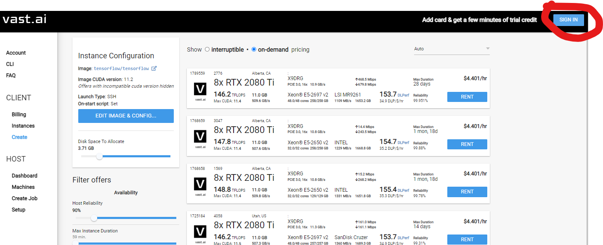

Under the account setup, setup your public ssh key. You can refer to
this section if you need help – https://vast.ai/faq/#Troubleshooting

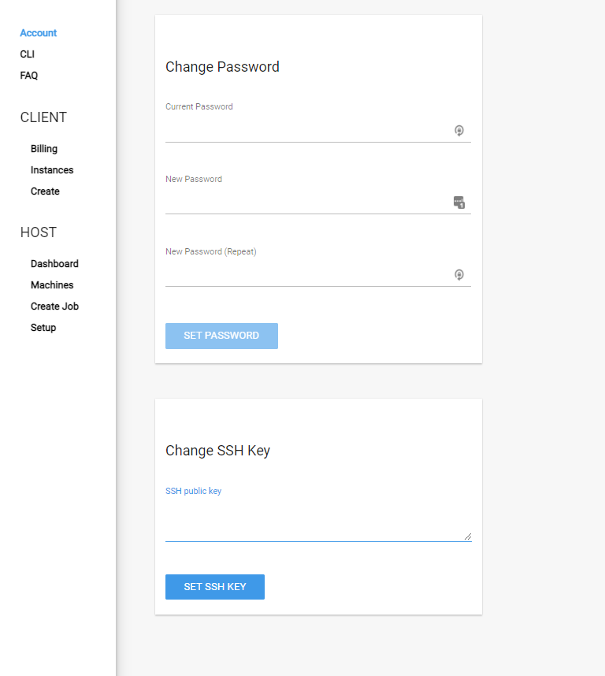

Click Client/Create

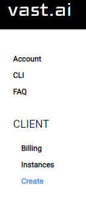

Click on EDIT IMAGE & Config under the Instance Configuration.

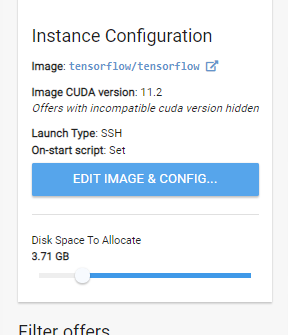

Most of the images have the necessary drivers that we need. I selected
‘tensorflow/tensorflow’ image. Select ‘Run Interactive shell server,
SSH.

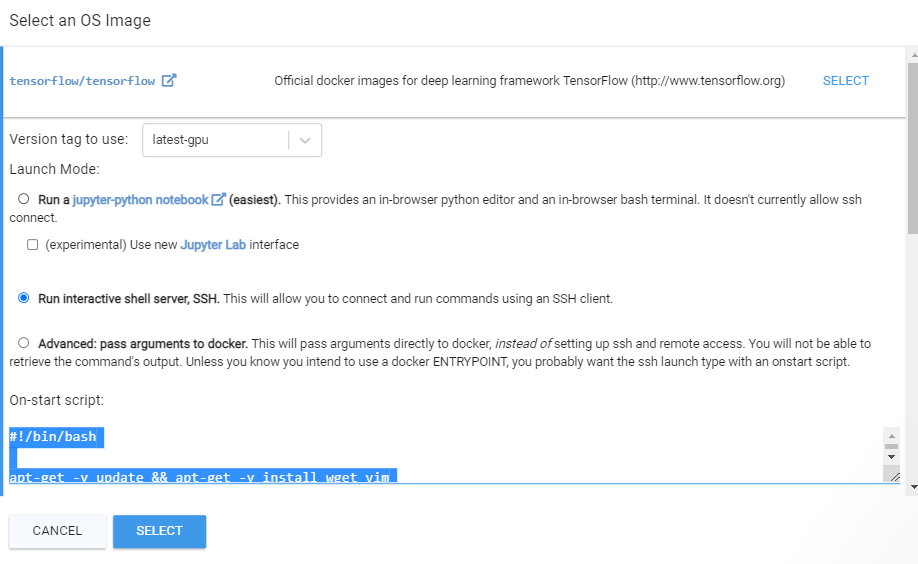

Paste the following script into the On-Start script box. **In the script
below, replace your mining addresses in place of the defaults below**.
Also, note that right now, the script downloads the miner version 0.5.0,
and the miner version 0.4.4 – because some vast.ai servers don’t have
the correct drivers for 0.5.0 – it will try to run 0.5.0 first and if it
fails run 0.4.4. Obviously, this should be adjusted as new versions of
the miner and proxy software are released.

Again the below mining addresses are example addresses – put in your
info instead.

**Note** - please use the updated script at https://github.com/diomark/alph/blob/main/miningAlphOnVast.md#updated-script-to-use-the-latest-053-miner
```
#!/bin/bash
if [[ ! -f config.json ]]
then
apt-get -y update && apt-get -y install wget vim
wget https://github.com/alephium/gpu-miner/releases/download/v0.5.0/alephium-0.5.0-cuda-miner-linux
wget https://github.com/alephium/mining-proxy/releases/download/v0.1.2/alephium-mining-proxy-0.1.2-linux
wget https://github.com/alephium/gpu-miner/releases/download/v0.4.4/alephium-0.4.4-cuda-miner-linux

cat <<EOT >> config.json
{
    "diff1TargetNumZero": 30,
    "jobSize": 4096,
    "serverHost": "52.18.87.57",
    "serverPort": 20032,
    "proxyPort": 30032,
    "addresses": [
    "1GV4EfsCmcvRf9UpQfkDEwwUD6HMVGbQyEMbAvTUUenhN",
    "1Dp2KG3cgawa32V4DRgLYMxZG4ubEoDpvers7pfj97VRx",
    "112ZBjKPnnAJJ2PapKAnzS8n3sgHXuEack1jXpQzyRWHP",
    "13kEM1VA3DDvcbX8n9aNRioD2PNXokTebWHgeJZhAjCqG"
  ]
}
EOT
chmod +x ale*
fi
while true; do ./alephium-mining-proxy-0.1.2-linux; done &
while true; do ./alephium-0.5.0-cuda-miner-linux  -p 30032; ./alephium-0.4.4-cuda-miner-linux  -p 30032; sleep 1; done &
```


If you're concerned about the time going out of sync/etc (some pool users have reported stale shares after running for a bit) - then replace the last two lines with these new lines which will run for 15 minutes then restart -

```
while true; do timeout 1800 ./alephium-mining-proxy-0.1.2-linux; done &
while true; do timeout 1800 ./alephium-0.5.0-cuda-miner-linux  -p 30032; timeout 1800 ./alephium-0.4.4-cuda-miner-linux  -p 30032; sleep 1; done &
```

Afterwards, you can set the Disk Space to Allocate to a smaller amount
since you don’t need that much disk space for this activity. 2-3GB’s is
plenty.

Pick a server – All vast.ai servers can mine Alephium, although 10x
series will mine much slower. You can refer to the hashrate spreadsheet
available here
<https://docs.google.com/spreadsheets/d/10eUjwGU-Kmw1XM1dDOKfdscOeShakSnjcBGzBT46rmc/view>
to see what you can expect on a given card. Once you’ve selected the
sever that you like, click RENT

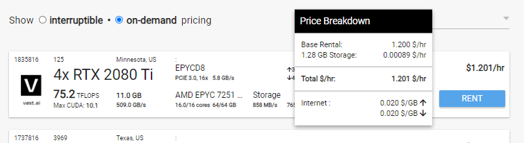

Assuming you have credit, the server instance will be created. If you
see a message stating insufficient funds, add sufficient credit to your
account. Also note that starter accounts can only rent one machine. As
your account ages, you can rent additional machines.

Click on Client / Instances <https://vast.ai/console/instances/> -
you’ll see the machine initializing. This hsouldn’t take more then a
minute or so.

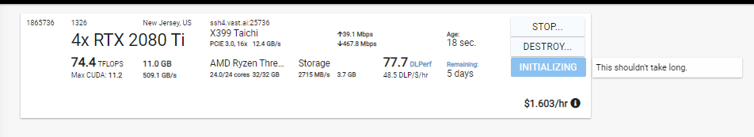

Once initialized, click ‘Start’ if not automatically started. At this
point, it should automatically download the mining software and start
mining against the wallets you set above. To see status, click Connect.

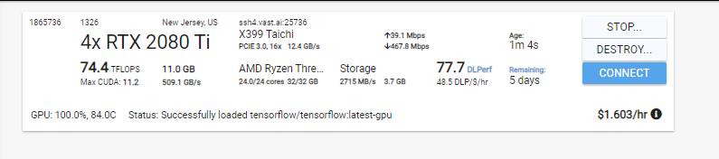

It will give you the SSH information. Remember you have to use the SSH
key that you previously setup to connect.

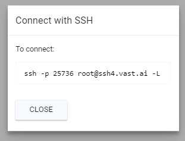

Using the displayed SSH information, connect to your server. In my case
my home server has the correct ssh keys, so I can just paste the string
displayed directly into a terminal to connect. Accept the new
fingerprint warning and login. If your SSH key has a passphrase, you’ll
have to type it now.

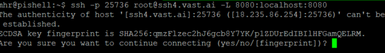

Once logged in, you can tail the ‘onstart.log’ file to see status of the
miner script – run ‘tail -f onstart.log’ – you can exit by pressing
control-c

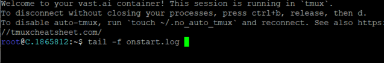

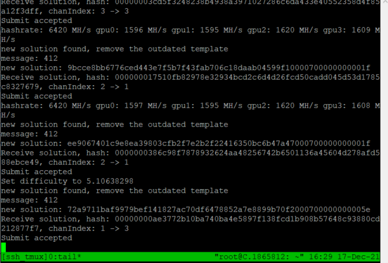

## Updated script to use the latest 0.5.3 miner as well as the 0.2.0 mining proxy
```
#!/bin/bash
if [[ ! -f config.json ]]
then
apt-get -y update && apt-get -y install wget vim
wget https://github.com/alephium/mining-proxy/releases/download/v0.2.0/alephium-mining-proxy-0.2.0-linux
wget https://github.com/alephium/gpu-miner/releases/download/v0.5.3/alephium-0.5.3-cuda-miner-linux


cat <<EOT >> config.json
{
    "diff1TargetNumZero": 30,
    "jobSize": 4096,
    "serverHost": "52.18.87.57",
    "serverPort": 20032,
    "proxyPort": 30032,
    "addresses": [
    "1GV4EfsCmcvRf9UpQfkDEwwUD6HMVGbQyEMbAvTUUenhN",
    "1Dp2KG3cgawa32V4DRgLYMxZG4ubEoDpvers7pfj97VRx",
    "112ZBjKPnnAJJ2PapKAnzS8n3sgHXuEack1jXpQzyRWHP",
    "13kEM1VA3DDvcbX8n9aNRioD2PNXokTebWHgeJZhAjCqG"
  ]
}
EOT
chmod +x ale*
fi
while true; do ./alephium-mining-proxy-0.2.0-linux; done &
while true; do ./alephium-0.5.3-cuda-miner-linux  -p 30032; sleep 1; done &
```

## Troubleshooting / bad hosts
Check that you’re getting the expected hashrate and that things are
working well. I rented several rigs in my testing, and did encounter one
rig which just wasn’t performing at the advertised rate. It’s easy
enough to ‘destroy’ that instance and start a new one. In this case, I’m
expecting around \~1700MH for the 2080TI (from the hashrate spreadsheet)
\* 4 cards, and this particular VM is close enough. These VM’s wont’ be
overclocked.

Sometimes you get a bad host that just doesn't work right. Unexpectedly low hash rate, outdated drivers, etc. If you're having issues, just destory the host and get a different one.

i.e. - here's an older host that the miner did not like. Viewing onstart.log showed these messages -
```
MapSMtoCores for SM -1116927728.21967 is undefined.  Default to use 128 Cores/SM
GPU #32681 has #4194048 cores
MapSMtoCores for SM -1116927728.21967 is undefined.  Default to use 128 Cores/SM
GPU #32682 has #4194048 cores
MapSMtoCores for SM -1116927728.21967 is undefined.  Default to use 128 Cores/SM
GPU #32683 has #4194048 cores
```
